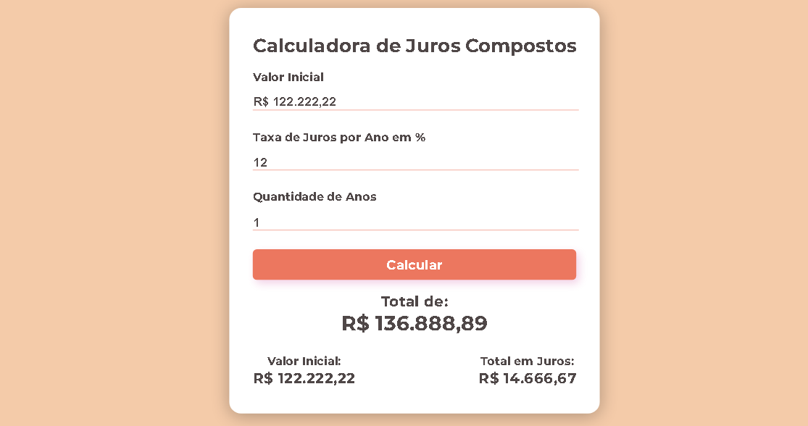

# Calculadora Juros Compostos
O projeto consistiria na criação de uma página web com uma interface amigável e fácil de usar, na qual os usuários possam inserir o valor inicial do investimento, a taxa de juros e o tempo de investimento. O HTML seria utilizado para criar a estrutura da página, o CSS para dar estilo e formatação e o JavaScript para calcular o montante final.

[##Página](https://nathanrigolei.github.io/juros-compostos-calculadora/)
